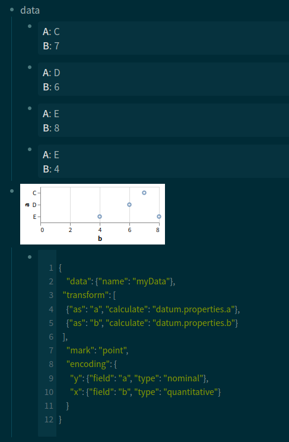

# logseq-plugin-embed-vegalite

Embed [Vega-Lite](https://vega.github.io/vega-lite/docs/) graphics to Logseq notes

## Example

````markdown
- data
  - a:: C
    b:: 7
  - a:: D
    b:: 6
  - a:: E
    b:: 8
  - a:: E
    b:: 4
- {{renderer :vegalite,myData=(and (page <% current page %>) (property a))}}
  - ```json
    {
      "data": { "name": "myData" },
      "transform": [
        { "as": "a", "calculate": "datum.properties.a" },
        { "as": "b", "calculate": "datum.properties.b" }
      ],
      "mark": "point",
      "encoding": {
        "y": { "field": "a", "type": "nominal" },
        "x": { "field": "b", "type": "quantitative" }
      }
    }
    ```
````



Notes:

- `datum` is basically [BlockEntity](https://logseq.github.io/plugins/interfaces/BlockEntity.html) and it has extended field `ext` (See `db/parse.ts`)
- You can use [named data sources of Vega-Lite](https://vega.github.io/vega-lite/docs/data.html#named) as the above `myData`

See [cookbook](./examples/) for more examples.

## License

MIT

https://github.com/logseq/logseq-plugin-samples/tree/master/logseq-pomodoro-timer

icon https://www.iconfinder.com/icons/3213271/business_clip_board_data_medical_report_icon
